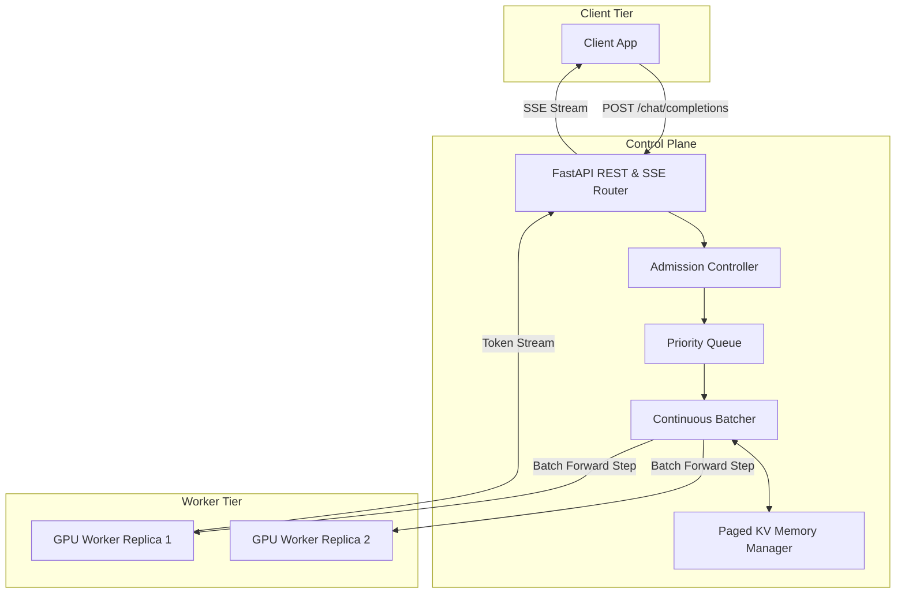

# System Architecture & GPU Memory Layout

```mermaid
flowchart TD
    subgraph Client Tier
        User[Client App]
    end

    subgraph Control Plane
        API[FastAPI REST & SSE Router]
        Admission[Admission Controller]
        Queue[Priority Queue]
        Scheduler[Continuous Batcher]
        KVManager[Paged KV Memory Manager]
    end

    subgraph Worker Tier
        Worker1[GPU Worker Replica 1]
        Worker2[GPU Worker Replica 2]
    end

    User -->|POST /chat/completions| API
    API --> Admission
    Admission --> Queue
    Queue --> Scheduler
    Scheduler <--> KVManager
    Scheduler -->|Batch Forward Step| Worker1
    Scheduler -->|Batch Forward Step| Worker2
    Worker1 -->|Token Stream| API
    API -->|SSE Stream| User
```
