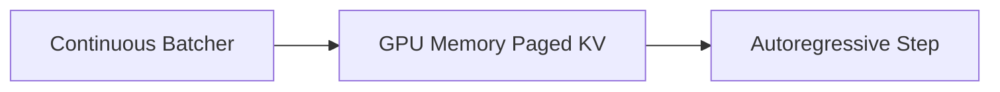

# 14.13 Real-Time Token Generation & Streaming

## Technical Specification & Deep Dive
Sub-millisecond token dispatch over persistent HTTP connections.

```mermaid
flowchart LR
    Scheduler[Continuous Batcher] --> VRAM[GPU Memory Paged KV]
    VRAM --> Execution[Autoregressive Step]
```
