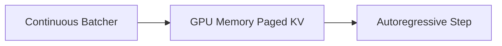

# 14.16 Cost Modeling & GPU Cloud Projections

## Technical Specification & Deep Dive
Cost per million tokens across AWS A100 vs H100 clusters.

```mermaid
flowchart LR
    Scheduler[Continuous Batcher] --> VRAM[GPU Memory Paged KV]
    VRAM --> Execution[Autoregressive Step]
```
